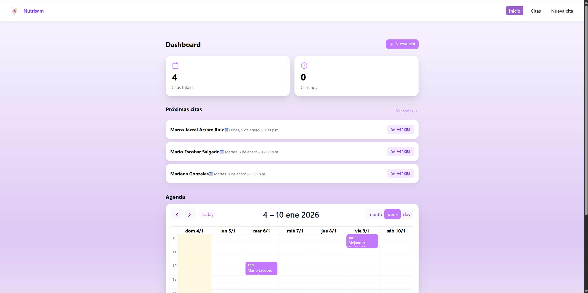
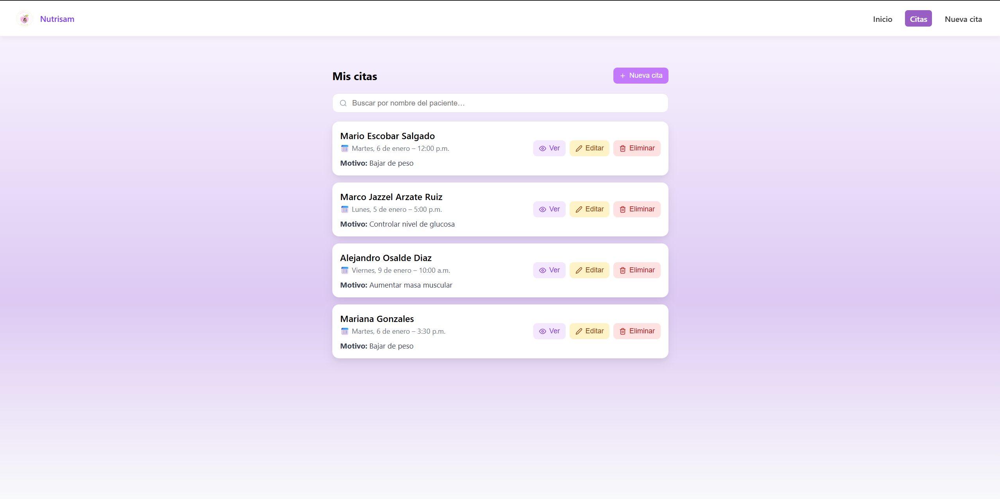
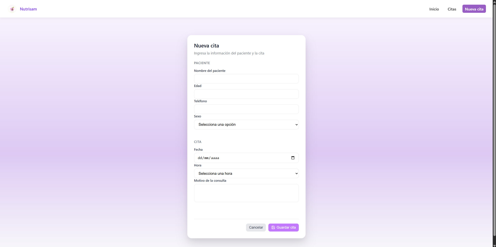
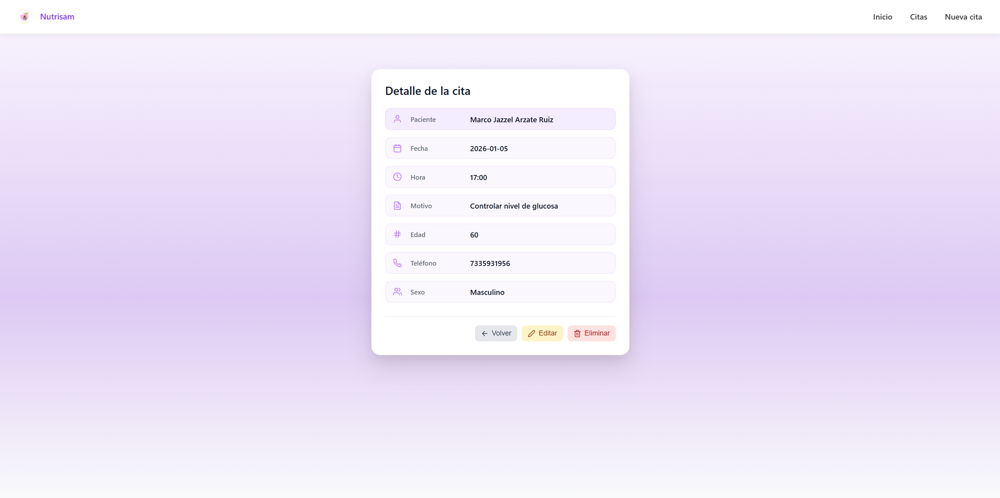
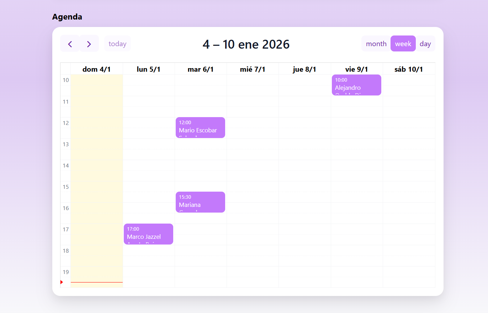

# 🥗 Nutrisam Appointments

Aplicación web para la **gestión de citas nutricionales**, diseñada como un **MVP realista** orientado a una consulta profesional de nutrición.

Permite crear, visualizar, editar y organizar citas mediante un **dashboard moderno** y una **agenda interactiva**, priorizando una experiencia clara y eficiente tanto para la nutrióloga como para el paciente.

---

## 📸 Vista previa

### Dashboard



### Lista de citas



### Nueva cita



### Detalle de cita



### Calendario



---

## ✨ Características principales

- 📅 Gestión completa de citas (Crear, Editar, Ver, Eliminar)
- 🧭 Dashboard con métricas clave y próximas citas
- 🗓️ Calendario interactivo con vistas **día / semana / mes**
- ⏰ Horarios configurados por intervalos de 30 minutos
- 🧠 Manejo correcto de fechas en horario local
- 🧾 Vista detallada de cada cita
- 🔍 Búsqueda en tiempo real por nombre del paciente
- 🎨 Interfaz moderna, limpia y profesional

---

## 🧠 Decisiones técnicas

Este proyecto fue desarrollado con enfoque en **buenas prácticas frontend**, escalabilidad y claridad de código:

- ⚛️ **React + Vite** para un entorno rápido y moderno
- 🧠 **Estado levantado en App.jsx** simulando persistencia real
- 🗓️ **FullCalendar** para una agenda profesional (no reinventar la rueda)
- 🧩 **Componentes reutilizables** (Button, Input, Layout)
- 🛠️ **Helpers reutilizables** para fechas y formato de texto
- 📁 **Separación clara de responsabilidades** (`pages`, `components`, `utils`)

Actualmente el proyecto funciona **sin backend**, pero está preparado para integrarse fácilmente con una **API REST**.

---

## 🛠️ Tecnologías utilizadas

- React
- Vite
- React Router
- FullCalendar
- React Icons
- CSS moderno (Flexbox / Grid)

---

## 🗺️ Roadmap (próximas mejoras)

Funcionalidades planeadas para la evolución del proyecto:

- 🔐 Autenticación de usuarios (nutrióloga / pacientes)
- 💾 Persistencia con backend (API REST + base de datos)
- 📱 Diseño responsive avanzado (mobile-first)
- 📊 Reportes y estadísticas mensuales
- 🔔 Recordatorios automáticos de citas
- 🧾 Historial clínico por paciente
- 🌐 Deploy en producción

---

## 🚀 Cómo ejecutar el proyecto

1. Clonar el repositorio

```bash
   git clone https://github.com/MarioSlgd/nutrisam-appointments.git
```

2. Entrar al proyecto:

```bash
   cd nutrisam-appointments
```

3. Instalar dependencias:

```bash
   npm install
```

4. Ejecuta en desarrollo:

```bash
   npm run dev
```
